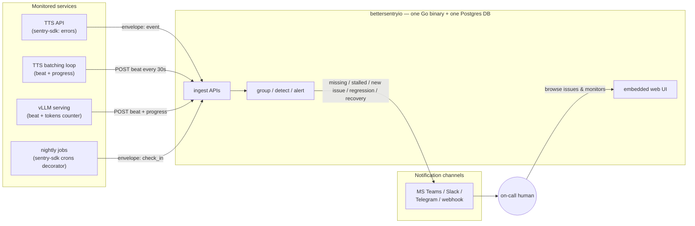
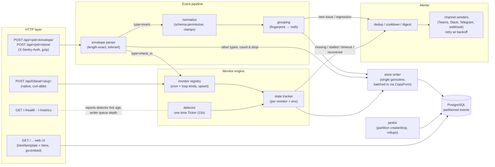
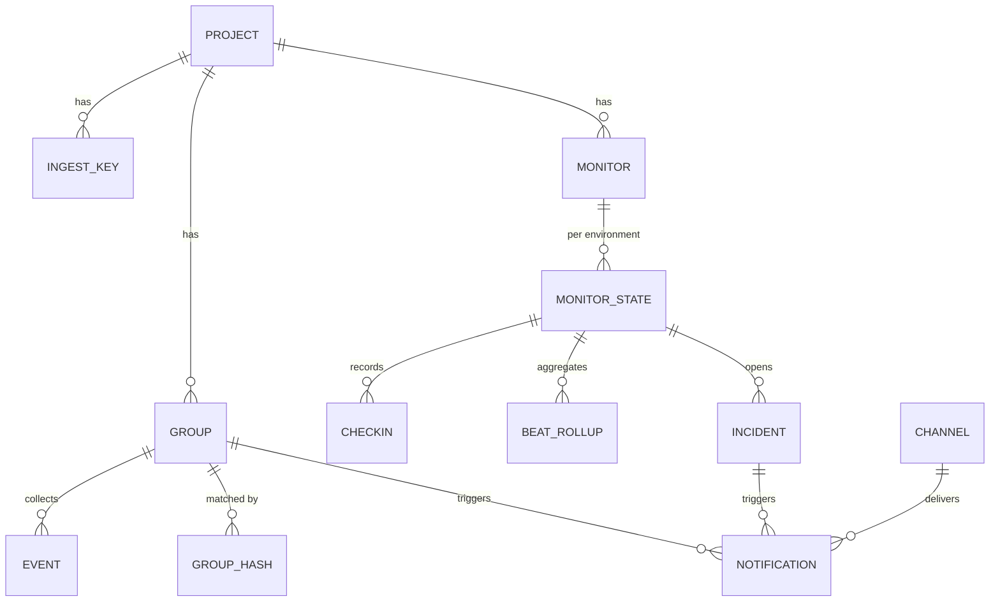
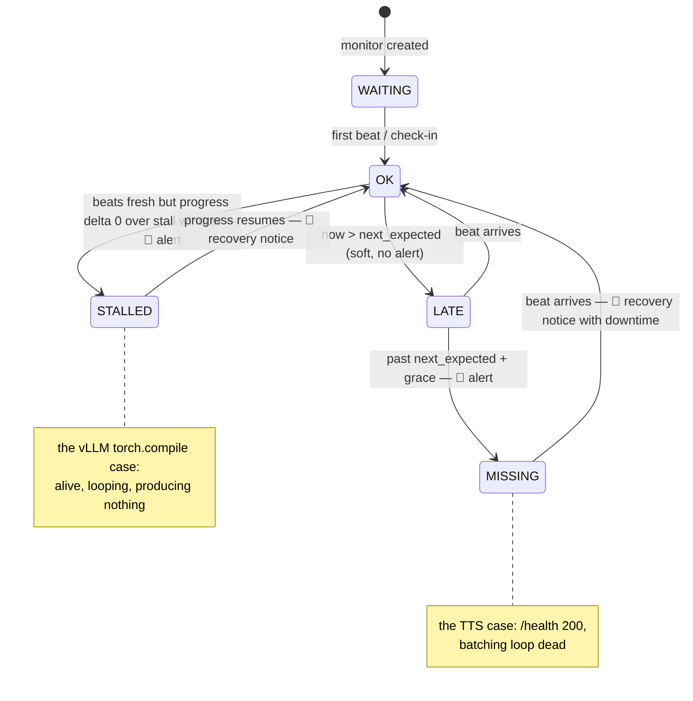
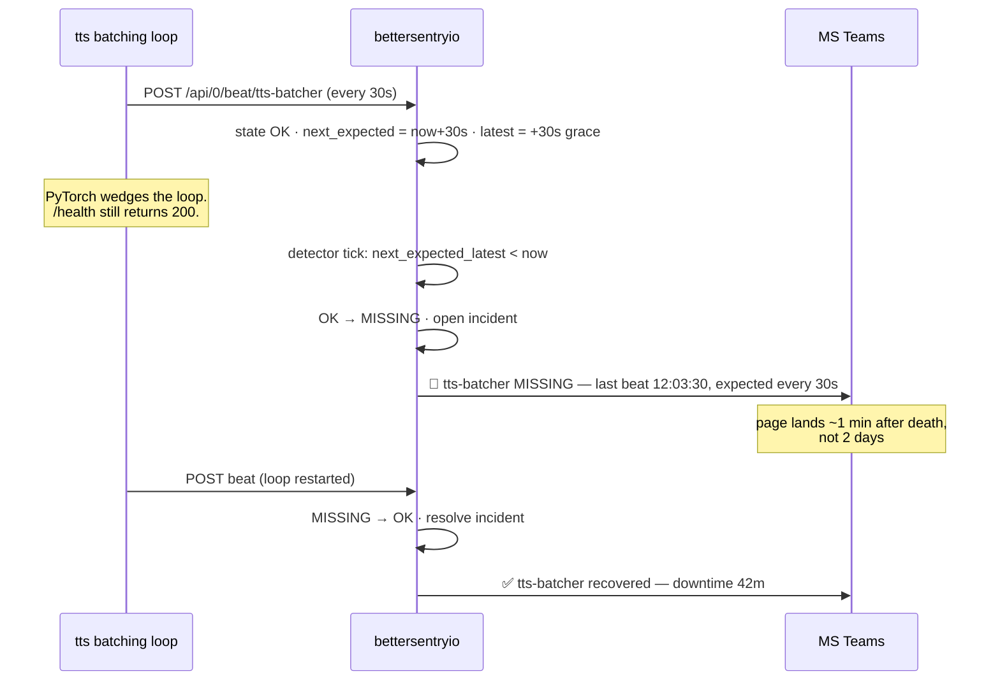
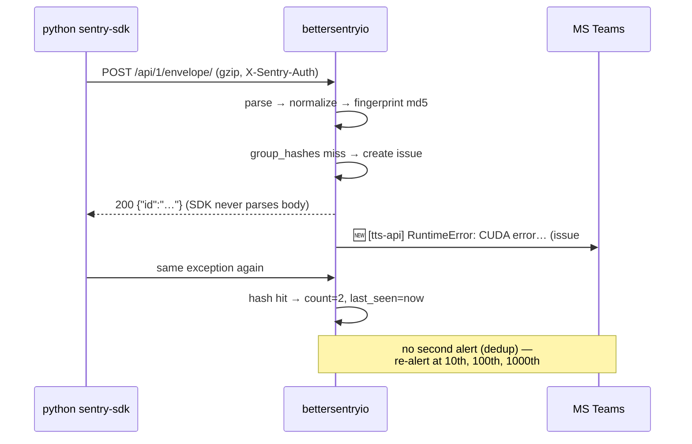

# bettersentryio — Architecture

> Companion to [PLAN.md](PLAN.md). Protocol/algorithm details are grounded in the Sentry source —
> see [docs/research/](docs/research/). Language: Go (decision D1 — architecture is
> language-agnostic; everything below maps 1:1 to Rust/tokio if D1 is vetoed).

## 0. Design tenets

1. **One process, one database.** A single static binary (`CGO_ENABLED=0`, `pgx/v5` is pure Go);
   all state in one PostgreSQL database. Postgres is the *only* external dependency we accept —
   no queue, no cache tier, no second storage engine, no third moving part — ever (PLAN §3, D2a).
2. **Inside-out monitoring.** The monitored loop proves its own liveness (beats) and its own
   usefulness (progress). Outside-in probes are somebody else's product.
3. **Compatible where it pays, native where it's simpler.** Speak Sentry's envelope protocol so
   existing SDKs drop in; offer a one-line native API so a shell script can be monitored too.
4. **The server must not lie the way our /health did.** bettersentryio's own health endpoint reports
   the age of its internal loops (detector tick, writer queue) — if its loops wedge, it says so.

## 1. System context



## 2. Component architecture (inside the binary)



**Goroutine inventory** (the whole concurrency model):

| Goroutine | Count | Job | Backpressure |
|---|---|---|---|
| HTTP handlers | pool (net/http) | parse, validate, enqueue | bounded channel full → `429` + `Retry-After` |
| Store writer | **1** | drain channel, batch into one tx per ~50 ms / 500 rows (`pgx CopyFrom`) | channel cap ~10k |
| Detector | **1** | 15 s tick: miss / timeout / stall scans | reads only; writes via writer |
| Alerter | 1 + per-channel | format payloads, POST with retry (3×, expo backoff), at-least-once | bounded queue; overflow → digest alert |
| Janitor | **1** | hourly: pre-create tomorrow's partition, drop expired ones, roll up beats | off-peak, `ANALYZE` after |

The single writer is now an **optimization, not a constraint** — Postgres would happily take
concurrent writers; batching one goroutine's inserts is simply the cheapest way to hit the
throughput target, and it keeps the pool footprint at ~1 connection under load. Because every
batch is a transaction, a `kill -9` mid-write loses the in-flight batch and nothing else — no
torn rows, no recovery step. Readers (UI, detector) use the same small `pgxpool` and never block
on ingest thanks to MVCC.

**Multi-replica path (built).** Nothing in the design assumes a single process except the
detector, which must tick exactly once. It is guarded with `pg_try_advisory_lock(LockDetector)`,
held across ticks on a dedicated connection rather than re-raced each tick: whichever replica
holds the lock detects, the rest stand by (and say so — `/-/health` reports `leader: false`
instead of a stale tick, and `bsio_detector_leader` is the metric to alert on). A session lock
dies with its connection, so the holder crashing *is* the standby's takeover signal; a per-tick
ping on the holding connection turns the reverse case — the lock dying under a live holder —
into a demotion instead of split-brain. That turns HA into a replica-count change rather than a
rewrite — the thing a single-writer file could never offer.

## 3. Data model



DDL sketch (final form lives in `internal/store/migrations/`):

```sql
projects      (id BIGSERIAL PK, slug TEXT UNIQUE, name TEXT, created_at timestamptz)
ingest_keys   (id, project_id → projects, public_key TEXT UNIQUE, created_at, revoked_at)

-- error tracking
groups        (id BIGSERIAL PK, project_id, short_id BIGINT, title TEXT, culprit TEXT,
               level TEXT, status TEXT NOT NULL CHECK (status IN ('open','resolved','muted')),
               first_seen timestamptz, last_seen timestamptz, event_count BIGINT,
               last_event_id TEXT,
               search tsvector GENERATED ALWAYS AS
                 (to_tsvector('simple', title || ' ' || culprit)) STORED)
               -- INDEX GIN (search)                      ← message search, replaces FTS5
               -- INDEX (project_id, status, last_seen DESC)
group_hashes  (project_id, hash TEXT, group_id, PRIMARY KEY (project_id, hash))
               -- INSERT … ON CONFLICT DO NOTHING RETURNING → atomic first-writer-wins
events        (id TEXT /*32-hex*/, project_id, group_id, ts timestamptz, level TEXT,
               platform TEXT, sdk TEXT, message TEXT,
               raw bytea /*zstd-compressed envelope item*/, received_at timestamptz)
               PARTITION BY RANGE (received_at)           ← retention = DROP, not DELETE
               -- per-partition INDEX (group_id, ts DESC); BRIN (received_at)

-- monitoring
monitors      (id BIGSERIAL PK, project_id, slug TEXT, kind TEXT
                 CHECK (kind IN ('cron','loop')),
               name TEXT, config jsonb, disabled bool, muted bool, created_at,
               UNIQUE (project_id, slug))
monitor_state (monitor_id, environment TEXT DEFAULT 'production',
               status TEXT CHECK (status IN ('waiting','ok','late','missing','stalled')),
               last_beat_at timestamptz, last_progress BIGINT, progress_window jsonb,
               next_expected_at timestamptz, next_expected_latest timestamptz,
               open_incident_id, PRIMARY KEY (monitor_id, environment))
               -- INDEX (next_expected_latest) WHERE status IN ('ok','late')  ← miss scan
checkins      (id TEXT /*client check_in_id*/, monitor_id, environment,
               status TEXT CHECK (status IN
                 ('in_progress','ok','error','missed','timeout')),
               started_at, finished_at, duration_ms INT, expected_at, timeout_at)
               -- INDEX (timeout_at) WHERE status = 'in_progress'             ← timeout scan
beat_rollups  (monitor_id, environment, window_start timestamptz /*5-min buckets*/,
               beats INT, progress_delta BIGINT,
               PRIMARY KEY (monitor_id, environment, window_start))
incidents     (id BIGSERIAL PK, monitor_id, environment, kind TEXT CHECK (kind IN
                 ('missing','stalled','failed_checkins')),
               opened_at, resolved_at, last_alert_at)

-- alerting
channels      (id BIGSERIAL PK, name TEXT, type TEXT
                 CHECK (type IN ('webhook','slack','teams','telegram')),
               config jsonb, enabled bool)
notifications (id BIGSERIAL PK, dedup_key TEXT, channel_id, subject_kind, subject_id,
               sent_at timestamptz, UNIQUE (dedup_key, channel_id))
               -- ON CONFLICT DO NOTHING = concurrency-safe "alert once per transition"
```

Four shapes worth calling out:

- **The detector's two scans are covered by *partial* indexes** — `WHERE status IN ('ok','late')`
  and `WHERE status = 'in_progress'`. The index only contains rows the detector can act on, so
  each 15 s tick touches a handful of pages regardless of how much history exists. These mirror
  Sentry's own hard-won invariants ([crons research](docs/research/sentry-crons-semantics.md)).
- **`events` is range-partitioned by `received_at`** (daily). Retention becomes
  `DROP TABLE events_2026_05_01` — instant, no vacuum debt — instead of a `DELETE` that has to
  scan and then leave dead tuples behind. This is the single biggest operational win over SQLite.
- **Loop beats never insert a row per beat** — they update `monitor_state` and one 5-minute
  `beat_rollups` bucket, so a 5 s loop costs ~12 writes/hour of history, not 720.
- **Both dedup paths use `ON CONFLICT`** (`group_hashes` for grouping, `notifications` for the
  alert ledger), which makes them correct under concurrent writers — a prerequisite for the
  multi-replica path above, and something the old single-writer design got only implicitly.

## 4. Wire protocol (Sentry-compatible subset)

Full contract with citations: [docs/research/sentry-ingest-protocol.md](docs/research/sentry-ingest-protocol.md). Summary:

- `POST /api/<project_id>/envelope/` — trailing slash required; `X-Sentry-Auth` header
  (`sentry_key`, versions 6/7) or `?sentry_key=`; `Content-Encoding: gzip|identity`
  (br/deflate SHOULD); newline-delimited envelope with length-exact item reads.
- Item routing: `event` → pipeline; `check_in` → monitor engine; `client_report` → count, never
  rate-limit; **everything else (incl. unknown types) → accept-and-drop with 200.** A well-formed
  envelope never gets a 4xx: SDK-side, errors here mean lost telemetry and noisy client logs.
- Response: `200 {"id":"<event_id>"}`. Limits: 20 MB envelope / 1 MB event → `413`;
  per-key token bucket → `429` + `Retry-After` + `X-Sentry-Rate-Limits`.
- Timestamps clamped to −30 d … +60 s (Sentry's window).
- DSN handed to users: `http://<public_key>@bettersentryio.internal:9090/<project_id>` — parseable by
  every official SDK.

## 5. Error pipeline

1. **Normalize** — permissive per `event.schema.json`: generate `event_id` if absent; clamp
   timestamp; accept tags as map or pair-array; truncate oversized fields (tag 256, culprit 200,
   message 8192).
2. **Group** — algorithm distilled from Sentry's `newstyle:2026-01-20`
   ([grouping research](docs/research/sentry-grouping.md)):

```
fp = event.fingerprint or ["{{ default }}"]
exc = last(event.exception.values)
if exc has stacktrace:
    frames = drop_consecutive_duplicate_frames(frames)
    frames = in_app(frames) or frames          # app variant, system fallback
    frames = last 30                           # nearest the crash
    parts  = [exc.type] + per-frame (module or lower(basename(filename)), trimmed function)
elif exc:  parts = [exc.type, parameterize(exc.value)]
else:      parts = [parameterize(first_2_lines(message))]
# parameterize: uuid, 0x/hex, int, float, email, url, ip, quoted-str → "<uuid>", "<hex>", …
values = parts                    if fp == ["{{ default }}"]
       = fp                       if "{{ default }}" not in fp
       = splice(fp, default→parts) otherwise
hash = md5(concat(values))
```

3. **Issue lifecycle** — `group_hashes` lookup: hit → bump `last_seen`/`event_count`; if the
   group was `resolved` → reopen and emit **regression** alert. Miss → create group (title
   `"{type}: {first line of value}"`, culprit = last in-app frame) → **new issue** alert.
4. **Store** — raw event JSON zstd-compressed in the row; only indexed columns extracted.

## 6. Monitor engine

Two kinds, one state machine:

| | `cron` (Sentry-compatible) | `loop` (bettersentryio-native) |
|---|---|---|
| Source | envelope `check_in` items (two-phase, `monitor_config` upsert, all semantics per [crons research](docs/research/sentry-crons-semantics.md)) | `POST /api/0/beat/<slug>?progress=<n>` (auto-create on first beat) |
| Schedule | crontab or interval, **minute granularity**, `checkin_margin`, `max_runtime` with in-progress re-arm | `expected_every` (seconds) + `grace` (seconds) |
| Detects | missed run, run timeout, N consecutive failures | dead loop (no beats) **and stalled loop (beats but frozen progress)** |
| Detection latency | ≥ 1 min (protocol floor) | ~`grace` + ≤15 s tick |



**Detector tick** (every 15 s, one goroutine):

```
now = monotonic-guarded wall clock
if now - last_tick > 5 min:            # host suspend / clock jump guard
    re-anchor all next_expected_*; skip alerting this tick
MISS:    state ∈ (ok,late) AND next_expected_latest <= now  → MISSING, open incident, alert
TIMEOUT: checkin in_progress AND timeout_at <= now          → TIMEOUT (cron kind), incident, alert
STALL:   loop kind, beats fresh, progress_delta(stall_window) == 0 → STALLED, incident, alert
LATE:    cosmetic only (UI badge), never alerts
```

Invariants copied from Sentry (they learned these the hard way):
- Synthetic misses never advance `last_beat_at` — a miss must not look like activity.
- After a miss, `next_expected` re-anchors to the most recent schedule slot before *now*
  (never `expected + interval`), so schedules don't drift after gaps.
- Recovery/ok transitions happen on **arrival** (beat/check-in handler), not in the tick —
  sub-second recovery notices.
- Out-of-order guard: a stale beat (older than `last_beat_at`) mutates nothing.
- A monitor that has never beaten stays `WAITING` — no false alarms for not-yet-deployed jobs.

**Progress/stall semantics** (`loop` kind, optional): each beat may carry a monotonic counter
(`?progress=1234` — batches processed, tokens generated). The engine keeps deltas in
`beat_rollups`; if beats keep arriving but Σdelta over `stall_window` (default 3×
`expected_every`, min 2 min) is zero → STALLED. Counter resets (process restart ⇒ smaller value)
are treated as progress, not stall.

## 7. Alerter

- **Dedup**: one notification per incident **transition** (`missing`, `stalled`, `recovered`,
  `new issue`, `regression`) — keyed in the `notifications` ledger, safe across restarts.
- **Re-alert**: still-open incidents re-notify every `realert_interval` (default 4 h, per-monitor
  override).
- **Storm control**: > N transitions within 60 s collapses into one digest ("🔴 14 monitors went
  missing — likely shared cause"). Per-issue alerts are additionally rate-capped (first, then
  10th, 100th, 1000th occurrence).
- **Channels**: generic JSON webhook (schema documented, stable), Slack blocks, MS Teams
  Adaptive Card, Telegram sendMessage. Config = URL + template type; secrets stay in the DB,
  never in logs.
- **Delivery**: at-least-once, 3 retries with exponential backoff; failures surface on
  `/-/metrics` and in the UI (an unreachable Teams webhook must not be a silent failure —
  that would be this project failing its own thesis).

## 8. Sequence: the two motivating incidents, replayed

**Dead loop (the TTS outage):**



**Error capture (drop-in SDK):**



## 9. Configuration surface (complete)

```
bettersentryio serve
  --database-url  postgres://user:pw@host/bettersentryio?sslmode=require
                                           # or $BSIO_DATABASE_URL / standard PG* vars
  --listen        :9090
  --base-url      https://bettersentryio.internal  # for links in alerts
  --admin-password-file /etc/bettersentryio/pw   # UI login; ingest auth = per-project keys
  --retention-events    90d                # implemented as partition drops
  --retention-checkins  14d                # raw; daily rollups kept 365d
  --log-format    text|json
```

Migrations are embedded and applied on startup (advisory-locked, so concurrent replicas can't
race). The binary never needs a writable data directory — it is stateless.

Everything else (projects, keys, monitors, channels, thresholds) is data, managed in the UI or
via `/api/0/…` admin endpoints — no config-file sprawl. Sentry has 539 settings + 651 options +
254 flags; bettersentryio has 7 flags. That asymmetry is the product.

## 10. Self-monitoring (eating our own dog food)

`GET /-/health` returns 200 **only if**: detector last tick < 45 s ago, writer queue < 80%
full, Postgres reachable and the pool not saturated, alerter queue draining. A DB outage reports
`degraded` (503) with the reason rather than crash-looping. Body reports each loop's age — the exact
information whose absence cost us two days. `/-/metrics` exposes the same as Prometheus text
for scraping later. Optionally, bettersentryio can beat to a *second* bettersentryio (or Healthchecks.io)
via `--watchdog-url` — who watches the watchmen, answered in one flag.

## 11. Performance budget

| Metric | Target | Mechanism |
|---|---|---|
| Sustained error ingest | ≥ 200 events/s (2 vCPU + Postgres) | batched writer, `CopyFrom`; zstd off critical path |
| Beat handling | ≥ 2,000 beats/s | state update + rollup bucket; no per-beat row |
| Detection latency (loop) | ≤ grace + 15 s | tick interval + partial-index scans |
| p99 ingest latency | < 20 ms | bounded queues; no per-request DB round trip |
| App idle RSS / binary | < 50 MB / < 20 MB | Go, no CGO, embedded assets (Postgres accounted separately) |
| DB pool | ≈10 connections | `pgxpool`; writer needs ~1 under load |
| Comfortable ceiling | hundreds of GB / ~100 monitors / ~10 services | partitioned retention; beyond this, buy Sentry |

## 12. Kubernetes deployment (optional layer)

Decision D10: **Helm chart yes, operator no; CRDs via the Traefik pattern** — the same binary,
run with `--kubernetes`, watches `Monitor`/`AlertChannel`/`Project` custom resources through
embedded controller-runtime and writes liveness back into `status` (so `kubectl get monitors`
shows STATE / LAST BEAT). Since D2 the pod is **stateless** — no PVC, ordinary `RollingUpdate`,
and `replicas > 1` is safe once the detector takes the advisory lock (§2). Full reasoning, CRD
sketches, topology diagram, and RBAC: [docs/design/kubernetes.md](docs/design/kubernetes.md).

## 13. Why there is no Kafka (and why in-process channels are enough)

**What Kafka actually does for sentry.io.** It is the durable commit log *between separate
programs*: Relay, 20 consumer groups, Snuba/ClickHouse writers run as different processes on
different machines, at millions of events per minute, multi-tenant. They need a network-visible,
disk-backed, replayable buffer with independently scalable consumers. Sentry's 52 topics exist
to connect its 42 processes — the queue is the wiring of the sprawl.

**Why that job doesn't exist here.** Our "producers" and "consumers" are goroutines in one
address space. The hop between them is a bounded channel: ~100 ns, no serialization, no network,
no broker to operate, no consumer-group rebalancing to debug. The durable-log role is played by
Postgres's own WAL, which is doing that job whether or not we put a broker in front of it.
Collapse the process sprawl and the queue's reason disappears — a broker between goroutines
would be Kafka connecting a program to itself.

**Feasibility numbers.**

| Stage | Realistic capacity | Our target (§11) |
|---|---|---|
| Bounded Go channel hop | millions of ops/s | 200 events/s + 2,000 beats/s |
| Batched Postgres inserts via `CopyFrom` | 10k–50k rows/s | same |
| Detector | 2 indexed scans per 15 s tick | ~100 monitors |

Headroom is 10–100×. M4's load test must prove the targets on the actual deployment host —
if it can't, the design (not the queue) is wrong.

**The honest trade-off.** Kafka gives at-least-once from broker-ack onward. An in-process
channel is at-most-once across the accept→commit window: the writer commits a batch every
~50 ms / 500 rows, so a `kill -9` loses at most roughly one second of accepted-but-uncommitted
telemetry (bounded by channel depth, ~10k items). That is the right trade for this data class:
errors are diagnostic and heavily duplicated (the lost event's siblings group into the same
issue), beats self-heal on the next interval, and monitor state is recomputed from the DB on
restart. Nothing flowing through this system is a payment record.

**Backpressure instead of buffering.** When the channel fills, we shed at the source — `429` +
`Retry-After` + `X-Sentry-Rate-Limits`, which official SDKs already honor (ingest research §5).
For telemetry, shedding beats buffering: a broker happily storing an hour-old backlog of stale
errors is negative value during an incident.

**The escape hatch (designed, not built) — cheaper since D2.** If a real durability requirement
appears: an append-only `inbox` table, accept = one INSERT, pipeline consumes it asynchronously
with `SELECT … FOR UPDATE SKIP LOCKED`. That upgrades accept→commit to at-least-once, and because
Postgres already gives us `SKIP LOCKED`, the same construct scales to *multiple* consumer
replicas — a work queue without a broker. Still YAGNI until someone names the requirement, but
the ceiling is now higher than it was with a single-writer file.

**When to revisit.** Sustained >5k events/s, replay/audit requirements, or genuine multi-region
ingest. (Note that "a second ingest node" and "a second writer process" have *dropped off* this
list — D2 makes both ordinary.) If one of the remaining three stops being a non-goal, revisit the
queue and the storage layout together.
