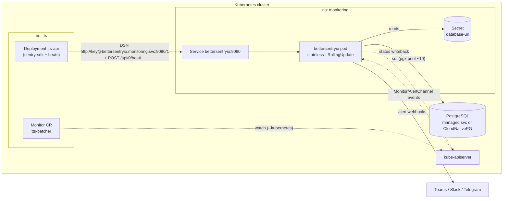

# bettersentryio × Kubernetes — operator, CRDs, or neither?

> Question from Ariff: *"the CRD for k8s, this needs to be in form of k8s operator or sumn?"*
> Short answer: **not an operator — but yes to CRDs**, consumed by the same single binary
> (the Traefik pattern), and only as an optional layer. Reasoning + sketches below.

## 0. TL;DR — the three-layer stance

| Layer | What | When |
|---|---|---|
| 1. Plain deployment | Dockerfile + systemd unit + **Helm chart** (stateless pod, no PVC, ordinary `RollingUpdate`; points at your Postgres) | M4 (v1) |
| 2. Declarative config via CRDs | `Monitor` / `AlertChannel` / `Project` custom resources, watched by **the same bettersentryio binary** with `--kubernetes` — no separate operator deployment | post-v1, only if our workloads actually live on k8s |
| 3. A "real" operator (separate controller managing bettersentryio itself) | ❌ never | — |

## 1. What an operator is actually for

The ecosystem consensus ([Datadog](https://www.datadoghq.com/blog/datadog-operator-helm/),
[groundcover](https://www.groundcover.com/blog/kubernetes-operator-vs-helm),
[TechTarget](https://www.techtarget.com/searchitoperations/tip/When-to-use-Kubernetes-operators-vs-Helm-charts)):
Helm for repeatable installs/upgrades of simple apps; an operator when the app needs **encoded
operational knowledge** — multi-node failover, coordinated upgrades, backup orchestration,
autoscaling of stateful fleets.

bettersentryio is *engineered to have no such knowledge to encode*: a stateless pod, no cluster
coordination, upgrade = replace the image, and **its one stateful dependency is deliberately
someone else's problem** — Postgres, which you either consume as a managed service or run with a
database operator (CloudNativePG) that already encodes exactly this kind of day-2 knowledge. That
split is the cleanest illustration of the rule: the database has real failover/backup/upgrade
choreography and therefore deserves an operator; bettersentryio has none and therefore doesn't.
An operator managing
bettersentryio would be automation with nothing to automate. The cautionary tale exists: the community
[sentry-operator](https://github.com/kanadaj/sentry-operator) is a C# controller that literally
reconciles Sentry's docker-compose file into a cluster — an operator wrapping a 42-process
application because the application gave it no better interface. We are building the better
interface instead.

**Also decisive:** our motivating workloads (TTS API, vLLM on GPU boxes) may run on bare metal /
VMs, not (only) in k8s. Beats and envelopes arrive over plain HTTP from anywhere. If bettersentryio
*were* an operator, non-k8s workloads would become second-class. Kubernetes must be an optional
deployment target, never the substrate.

## 2. Where k8s-native genuinely pays: config as CRDs

The [Prometheus Operator's ServiceMonitor/PrometheusRule pattern](https://www.tigera.io/learn/guides/prometheus-monitoring/prometheus-operator/)
([guide](https://www.plural.sh/blog/prometheus-operator-kubernetes-guide/)) proved the value:
monitoring config lives **in Git, next to the workload it watches**, applied by the same
`kubectl apply`/ArgoCD flow, diff-reviewed, rolled back like code. For us that means a team
deploying `tts-api` ships its `Monitor` in the same PR as its `Deployment` — monitoring can't
be forgotten, because it travels with the thing it monitors.

But Prometheus needs a *separate operator deployment* to translate CRs into config files and
restart Prometheus. bettersentryio doesn't: config is rows in its own DB behind an API. So we adopt
the **[Traefik pattern](https://www.plural.sh/blog/traefik-ingress-controller-kubernetes/)** —
the application itself watches its own CRDs
([controller-runtime](https://pkg.go.dev/sigs.k8s.io/controller-runtime) embedded,
[kubebuilder watch docs](https://book.kubebuilder.io/reference/watching-resources)) and
reconciles them into live state. Traefik consumes `IngressRoute` CRs with no "Traefik operator";
bettersentryio consumes `Monitor` CRs the same way. One binary stays one binary — Go's
controller-runtime makes this a small dependency, which is a point for decision D1.

The payoff feature — **status writeback**. The controller patches `status` + printer columns so:

```console
$ kubectl get monitors -A
NAMESPACE   NAME             KIND   STATE     LAST BEAT   AGE
tts         tts-batcher      loop   MISSING   14m ago     12d     ← visible in kubectl, no UI needed
pipelines   nightly-export   cron   ok        6h ago      30d
vllm        vllm-decode      loop   stalled   8s ago      12d     ← beating but progress frozen
```

## 3. CRD sketches (`v1alpha1`)

```yaml
apiVersion: bettersentryio.scicom.com.my/v1alpha1            # API group under our own domain (PLAN D9)
kind: Monitor
metadata:
  name: tts-batcher
  namespace: tts                          # lives WITH the workload it watches
spec:
  project: tts-api
  kind: loop
  loop:
    expectedEvery: 30s
    grace: 60s
    stall:
      window: 5m                          # beats fresh but progress Δ = 0 over window → STALLED
  notify: [teams-oncall]
---
apiVersion: bettersentryio.scicom.com.my/v1alpha1
kind: Monitor
metadata:
  name: nightly-export
  namespace: pipelines
spec:
  project: pipelines
  kind: cron
  cron:                                   # mirrors Sentry Crons config (research notes)
    schedule: "0 2 * * *"
    timezone: Asia/Kuala_Lumpur
    checkinMargin: 10m
    maxRuntime: 2h
    failureThreshold: 1
  notify: [teams-oncall]
---
apiVersion: bettersentryio.scicom.com.my/v1alpha1
kind: AlertChannel
metadata:
  name: teams-oncall
  namespace: monitoring
spec:
  type: teams
  urlSecretRef: { name: teams-webhook, key: url }   # webhook URL stays in a Secret
---
apiVersion: bettersentryio.scicom.com.my/v1alpha1
kind: Project
metadata:
  name: tts-api
  namespace: monitoring
spec:
  slug: tts-api
  # status gets: dsnSecretRef → generated key written to a Secret the workload mounts
```

Status subresource on `Monitor`:

```yaml
status:
  state: missing            # waiting | ok | late | missing | stalled
  lastBeat: "2026-08-10T04:12:31Z"
  openIncident: "inc_9f3k"
  observedGeneration: 3
```

Reconcile semantics: CRs are **one-way desired state** (CR → bettersentryio DB, status flows back).
UI edits to CR-owned objects are rejected ("managed by tts/tts-batcher") so GitOps stays the
source of truth; UI-created monitors coexist untouched. Deleting the CR deletes the monitor
(finalizer). Conflict rule: `(project, slug)` owned by whichever created it first.

## 4. In-cluster topology



Deployment notes:
- **The pod is stateless** (since PLAN D2) — no PVC, no `Recreate` constraint, ordinary
  `RollingUpdate` with zero ingest downtime. `replicas: 1` is the v1 default only because we
  haven't needed more; `replicas: 2+` is safe as soon as the detector takes its advisory lock
  (ARCHITECTURE §2), and migrations are advisory-locked so concurrent pods can't race on startup.
- **`database-url` lives in a Secret**, mounted as env (`BSIO_DATABASE_URL`). Prefer the managed
  cluster's own credential Secret over a hand-written one.
- RBAC is tiny: `get/list/watch` on the three CRDs + `update/patch` on `monitors/status` +
  read Secrets referenced by channels. Cluster-scoped watch, namespaced CRs.
- Helm chart ships CRDs optionally (`crds.install=true`); `--kubernetes` off = layer 1 only.
- **Failure-domain warning**: if the k8s cluster is what you're worried about, don't run the
  only bettersentryio inside it — and note the monitor now spans *two* failure domains, since a
  Postgres outage stops ingest (it degrades rather than crashes, but it stops). Keep the DB in the
  same domain as the pod so there's one thing to reason about, run the pair on a VM outside the
  cluster (systemd), or run two instances pointed at each other via `--watchdog-url`
  (ARCHITECTURE §10).

## 5. Adjacent idea from the research (stretch, not v1)

Sentry ships a tiny [sentry-kubernetes agent](https://github.com/getsentry/sentry-kubernetes)
that watches cluster **events** (CrashLoopBackOff, OOMKilled, failed probes) and reports them as
error events. With `--kubernetes` already watching the API server, bettersentryio could do the same
for the namespaces it monitors — an OOMKilled TTS pod becomes an issue with the pod's last state
attached. Cheap to add later; explicitly out of v1.

## 6. What we deliberately do NOT build

- No separate operator deployment, no operator-SDK/OLM bundles, no CSV/OperatorHub packaging.
- No leader election / HA controller machinery — one instance, one writer, by design.
- No CRD-based install of bettersentryio itself (that's Helm's job), no auto-upgrade automation.
- No admission webhooks in v1 (validate in the reconciler; write `status.conditions` on bad specs).

## Sources

[Datadog: Operator vs Helm](https://www.datadoghq.com/blog/datadog-operator-helm/) ·
[groundcover: Operator vs Helm](https://www.groundcover.com/blog/kubernetes-operator-vs-helm) ·
[TechTarget: when to use which](https://www.techtarget.com/searchitoperations/tip/When-to-use-Kubernetes-operators-vs-Helm-charts) ·
[Tigera: Prometheus Operator](https://www.tigera.io/learn/guides/prometheus-monitoring/prometheus-operator/) ·
[Plural: Prometheus Operator guide](https://www.plural.sh/blog/prometheus-operator-kubernetes-guide/) ·
[Plural: Traefik ingress guide](https://www.plural.sh/blog/traefik-ingress-controller-kubernetes/) ·
[controller-runtime](https://pkg.go.dev/sigs.k8s.io/controller-runtime) ·
[Kubebuilder: watching resources](https://book.kubebuilder.io/reference/watching-resources) ·
[sentry-kubernetes charts](https://github.com/sentry-kubernetes/charts) ·
[kanadaj/sentry-operator](https://github.com/kanadaj/sentry-operator)
